# twitter-sentiment-analysis
Twitter Sentiment Analysis with Spark, SparkStreaming, Kafka, Elasticsearch &amp; Kibana

Objective:
The aim of this project is to conduct Twitter data sentiment analysis to gain sentiment insights to analyze Emotion attached to the message.
Reading the Twitter stream from the Twitter-API with Kafka and stream them into a Spark-Cluster to process it.

Tools & Technologies:
•	Tweepy (And your own pair of API Keys from Twitter)
•	Kafka-Python
•	Pyspark (Python 3.7, Spark 2.4)
•	Elasticsearch5.4 
•	Kibana5.4 Dashboard 
•	NLTK with VADER 
•	Jupyter Notebook
•	Spark Streaming
•	Spark SQL

Tweepy: An easy-to-use Python library for accessing the Twitter API. Tweepy is a Twitter API Python wrapper, accessing both Twitter REST (including Search) and Stream APIs.
Twitter API: It is the System's source. We collect tweets in real-time using Twitter's API system.
PySpark: PySpark is a Spark API which enables you to interact with Spark through the Python shell.
Spark Steaming: Breakdown the Streaming data into smaller bits that are sent to the Spark Engine afterwards.
Kafka:  Kafka is real-time streaming data pipelines that get data between systems or applications in a secure way. Kafka is used for the development of real-time data pipelines and streaming applications. Apache Kafka is a distributed community-based event streaming application able to manage trillions of events a day. Kafka was originally conceived as a message queue and is based on an abstraction of a distributed commit log.
NLTK with VEDAR: VADER (Valence Aware Dictionary for sEntiment Reasoning) is a model used in the analysis of sentiments that is sensitive to both emotional polarity (positive / negative) and intensity (strength).
Jupyter Notebook: Jupyter Notebook is an open desktop platform and Python Web server, providing Jupyter users with a browser-based UI (user interface). Jupyter Notebooks are an ordered list of input / output cells, each providing a REPL (read-eval-print loop read-eval-print loop) for writing code, and a window for viewing real-time data.
Elasticsearch: Elasticsearch is a distributed open source, RESTful search and analytics engine able to solve a increasing number of use cases. Elasticsearch is an open source, distributed search and analytics engine for all data types, including textual, numerical, geospatial, organized, and unstructured. Based on Apache Lucene, Elasticsearch was first published in 2010, by Elasticsearch N.V. (Now called Elastic). Elasticsearch is the central component of the Elastic Stack, a collection of open source tools for data ingestion, enrichment, storage, analysis and visualization, known for its easy REST APIs, distributed design, speed, and scalability. The Elastic Stack also contains a large set of lightweight shipping agents known as Beats for sending data to Elasticsearch, usually referred to as the ELK Stack (after Elasticsearch, Logstash, and Kibana).
Kibana: Kibana is an Elasticsearch open source data visualization plugin. In addition to the content indexed on an Elasticsearch cluster, it offers visualization capabilities. In addition to large quantities of data, users can create bar, line and scatter plots, or pie charts and maps.

Implementation >> How it works:

We have the twitter users tweeting those posts with certain hashtags. Twitter provides an API for a few days to ask them in the past, or to read the livestream.
We are reading the stream with a Kafka Producer written in Python and after some cleaning we are sending the relevant part of the tweet to a subject on the Kafka server.
The Spark-Consumer is waiting on the other side of the Kafka Message queue while the tweets are being sent to the topic. The Spark-Streaming library has some Kafka Utility to collect the messages from the Kafka server and return them for processing in Spark RDDs.
Within the Spark-Consumer we let the Sentiment-Magic do the NLTK Vader package and add the result (negative / positive / neutral) to the tweet results.
We send the data to Elasticsearch at the end of a consuming loop to create some dashboards with Kibana to display the outcome of our sentiment analysis.
 
Connect to Twitter

Creating a new app and configuring OAuth credentials on Twitter account.
1. Connect https:/apps.twitter.com/. Sign in and press Create new App
2. Fill out the necessary fields 
3. Turn on the Yes under Developer Agreement, I agree to check box and click Build your Twitter application. 
4. Click the Keys and Access Tokens tab. 
5. Scroll down the page and then press the Build My Access Tokens button. 
6. Copy Consumer Key, Consumer Secret, Access Token, Access Token Secret

PART-I, Collecting Tweets
We need some tools to run along with the twitter stream:
•	You should use your own Twitter API-Token to access the API
•	Python module Tweepy to access Python Stream
•	Kafka-Python module for sending tweets to server Kafka

The full code can be found here, producerTwitterStream.py

At first, we import all required modules and provide the twitter API tokens to connect twitter to stream data.

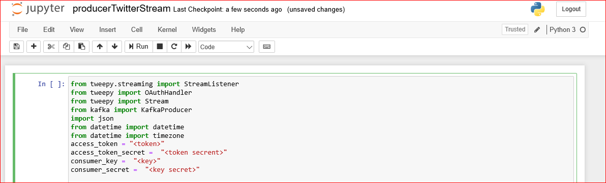

Then we define a StdOutListener who on the Stream listener defines the function on_data method with whatever tweets we get. The cleanTweet function cleans every tweet by simply extracting the user, date and text. After that, the tweet is sent to the "tweets_new" topic on Kafka producer.

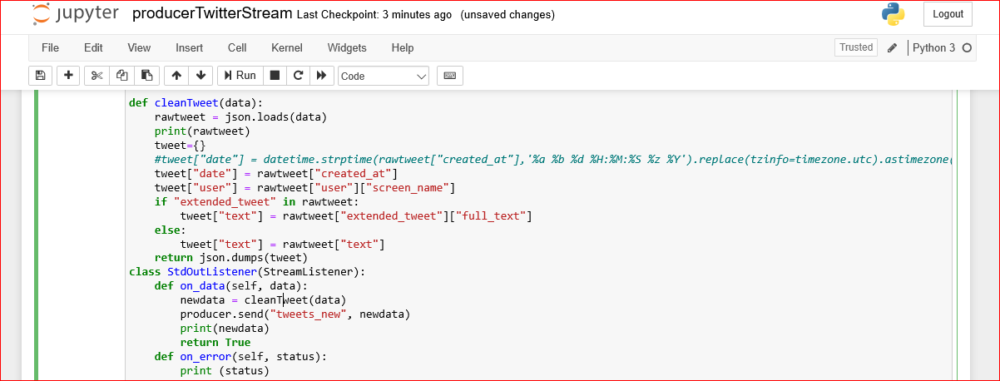

In addition to the API-Token we send our StdOutListener to the Tweepy Stream object and set a filter to some hashtag that we want to watch.

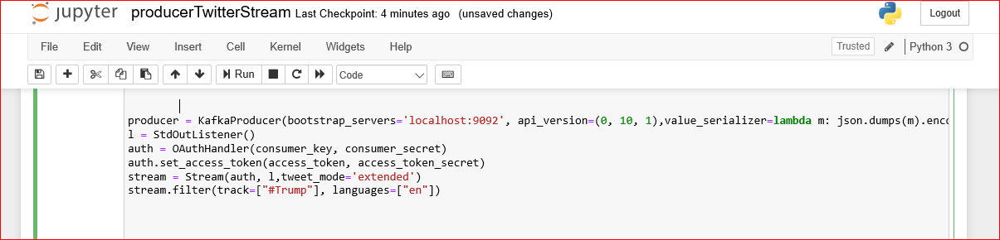

Once run producerTwitterStream.py file, it starts streaming the live tweets like below:

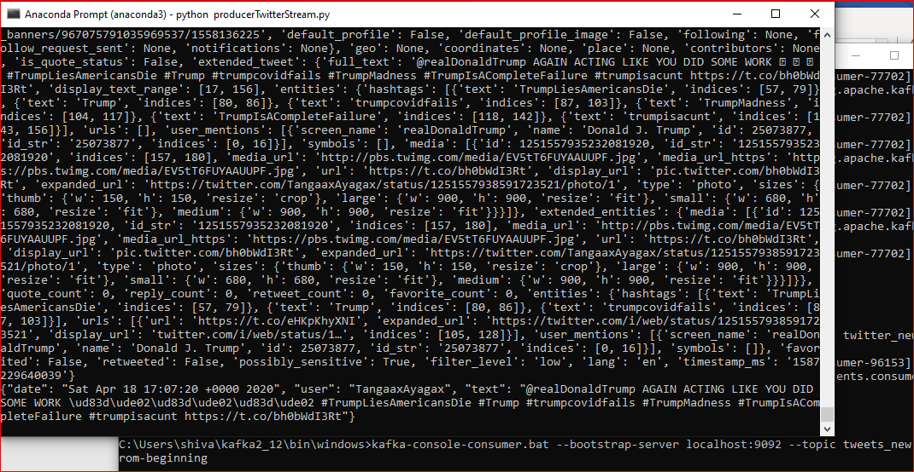

Start Kafka-Python module to send the tweets to the Kafka server, 
•	Start zookeeper, C:\Users\shiva\kafka2_12\bin\windows>zookeeper-server-start.bat ..\..\config\zookeeper.properties
•	Start kafka Server, C:\Users\shiva\kafka2_12\bin\windows>kafka-server-start.bat ..\..\config\server.properties
•	Start consumer to consume tweets, C:\Users\shiva\kafka2_12\bin\windows>kafka-console-consumer.bat --bootstrap-server localhost:9092 --topic tweets_new --from-beginning

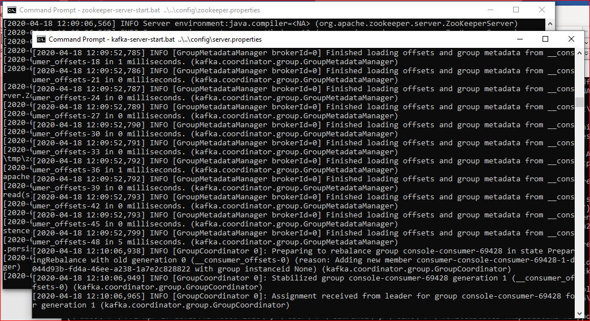

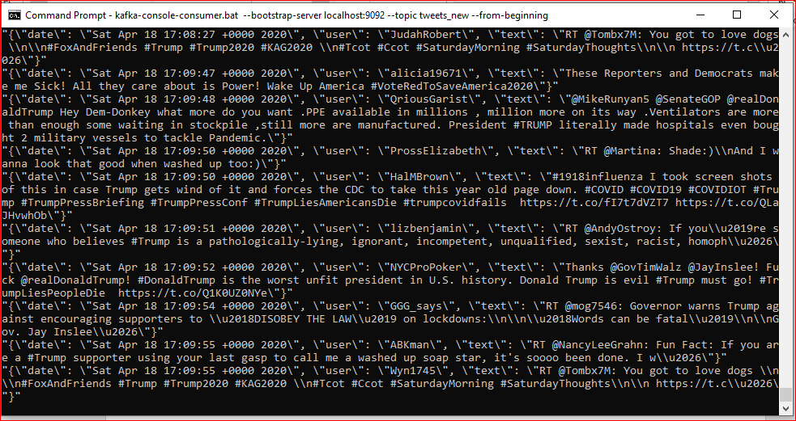

PART II, Launch Elasticsearch
•	Change the directory to the Elasticsearch\bin folder and type elasticsearch.dat to launch
•	After data process in spark, we push the data to elasticsearch

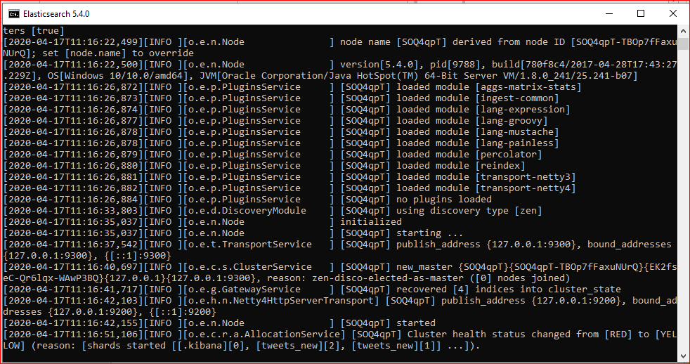

Part-III, Consume the tweets
We can use a Python Kafka-Consumer to process the tweets within a cluster to consume the tweets. The code you'll find inside, consumeTwitterSparkData.py, consumeTwitterSparkData.py.

First of all we import all required modules as shown below:

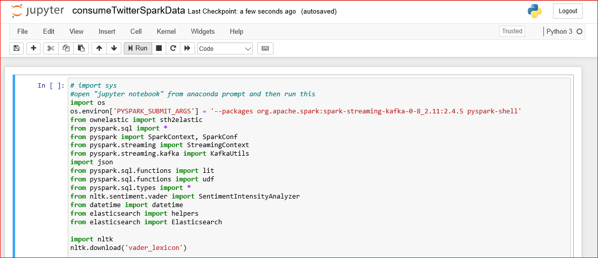

Then with our appName we create a SparkContext, then we create the StreamingContext with the SparkContext and let it wait 5 seconds to receive the next tweet bundle. After that we use the StreamingContext to create a KafkaConsumer, and we get the function do_process() from the Stream for every RDD. Process this code will run to infinity if we do not disable it.

We process the tweets within the do_process() function and we call the sentimentAnalysis() feature other than the message text for every message. The result of this function will be applied to the data as "sentiment" column.

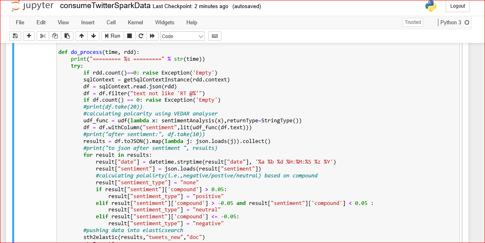

Inside the sentimentAnalysis() feature we process the text of the tweet with NLTK Vader's SentimentAnalyzer, which gives us some scores other than the positive, negative and neutral elements of the text and a composite score calculated from -1 (Negative) to 1 (Positive) and between. You may add certain details to the tweet data.

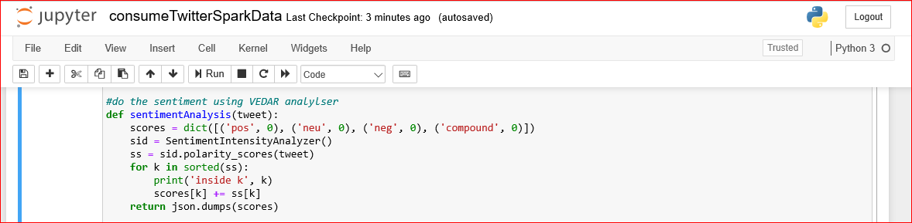

We can now submit our results to Elasticsearch and create a dashboard with Kibana still within the do_process() feature. 

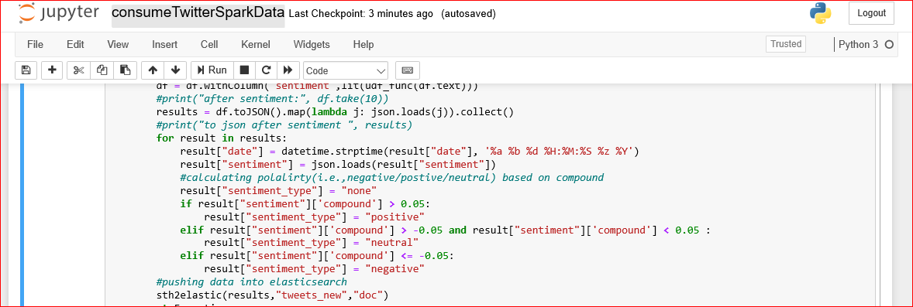

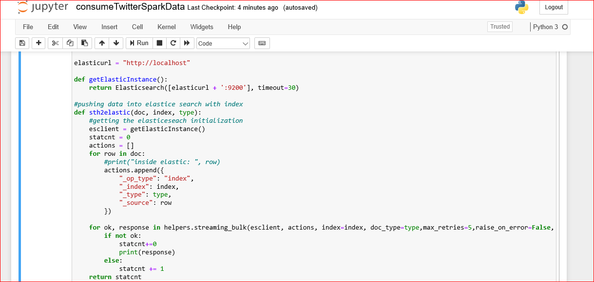

Run consumeTwitterSparkData.ipynb from jupyter notebook, So we can now send our result to elasticsearch and build a dashboard with kibana.

PART IV, Data Visualization (Dashboard):

Start Kibana in a few seconds after the python script starts running by moving the directory to the folder Kibana\bin and type kibana.dat.

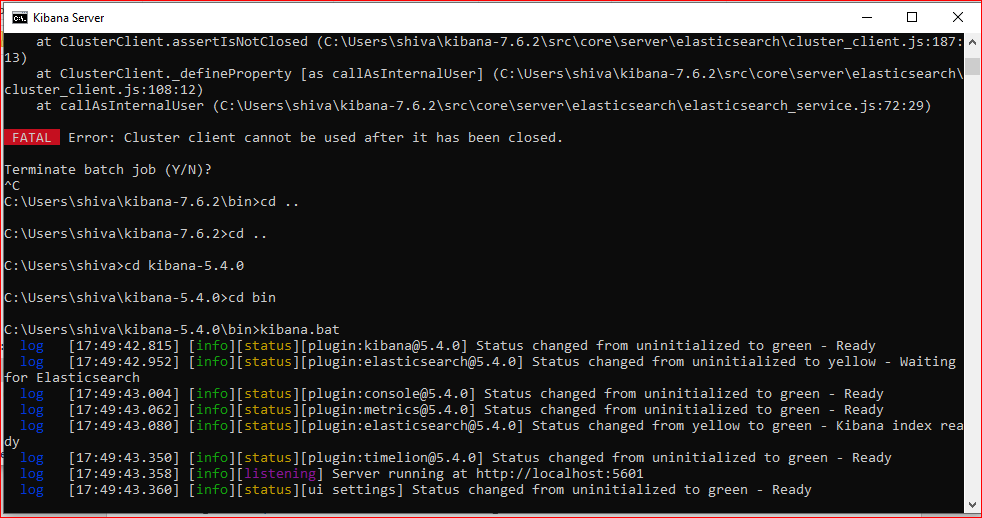

go to http://localhost:5601, move to Management --> Index -->+ Create Index Pattern to create an index name or pattern.

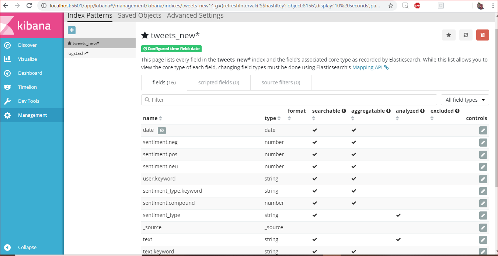

Now the tweets are saved inside Elasticsearch's "tweets_new" index, and we can build a dashboard that refreshes every few seconds.

In the dashboard we are trying to show the sentiment analysis in different ways for a particular keyword (#Trump). 
•	Showing total number of tweets streamed for the keyword #Trump
•	For the #Trump keyword showing as pie/donut chart the total number of negative/positive/neutral tweets
•	Showing as bar chart the top 10 users who tweeted as negative/positive/neutral against keyword #Trump
•	For the #Trump keyword showing as bar/Horizontal bar/line charts the total number of negative/positive/neutral tweets

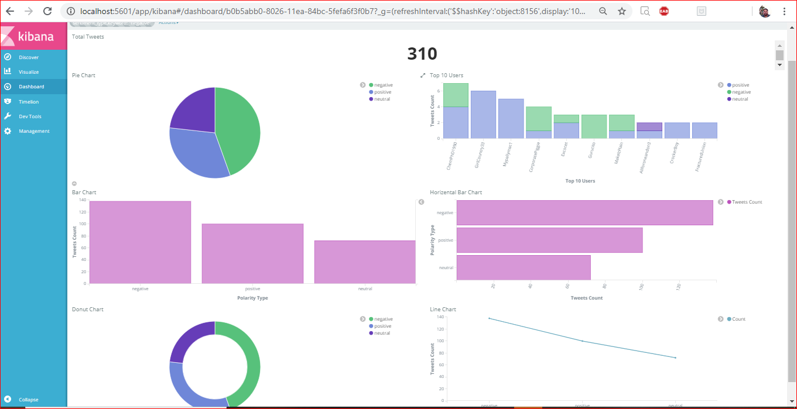

NOTE: Refer for full document, twittersentiment_doc.docx

