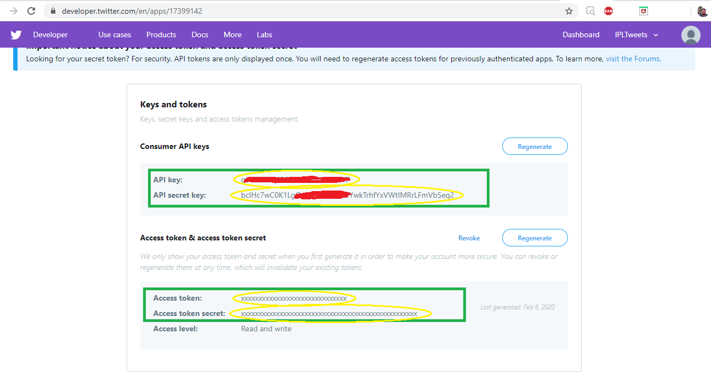
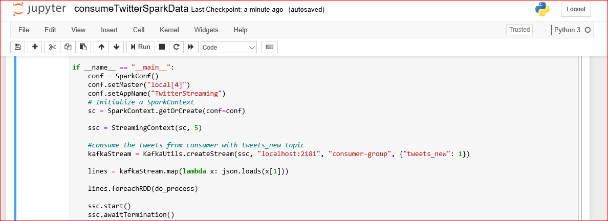

# twitter-sentiment-analysis
Twitter Sentiment Analysis with Spark, SparkStreaming, Kafka, Elasticsearch &amp; Kibana

Objective:
The goal of this project is to perform sentiment analysis on Twitter data for extracting sentiment insights to analyze Emotion attached to the tweet.
Reading the Twitter stream from the Twitter-API with Kafka and stream them into a Spark-Cluster to process it.

Tools & Technologies:
•	Tweepy (And your own pair of API Keys from Twitter)
•	Kafka-Python
•	Pyspark (Python 3.7, Spark 2.4)
•	Elasticsearch5.4 
•	Kibana5.4 Dashboard 
•	NLTK with VADER 
•	Jupyter Notebook
•	Spark Streaming
•	Spark SQL
Tweepy: An easy-to-use Python library for accessing the Twitter API. Tweepy is a Python wrapper for the Twitter API. It accesses the Twitter REST (including Search) and Stream APIs.
Twitter API: It is the source of the system. We are collecting real time tweets using API service provided by Twitter.
PySpark: PySpark is a Spark API that allows you to interact with Spark through the Python shell.
Spark Steaming: Breakdown the Streaming data into smaller pieces which are then sent to the Spark Engine.
Kafka:  Kafka is real-time streaming data pipelines that reliably get data between systems or applications. Kafka® is used for building real-time data pipelines and streaming apps. Apache Kafka is a community distributed event streaming platform capable of handling trillions of events a day. Initially conceived as a messaging queue, Kafka is based on an abstraction of a distributed commit log.
NLTK with VEDAR: VADER (Valence Aware Dictionary for sEntiment Reasoning) is a model used for sentiment analysis that is sensitive to both polarity (positive/negative) and intensity (strength) of emotion.
Jupyter Notebook: Jupyter Notebook is an interactive computing environment and Python web server, providing a browser-based UI (user interface) for Jupyter users. Jupyter Notebooks are an ordered list of input/output cells, each providing a REPL (read-eval-print loopread-eval-print loop) for writing code and a window to show output in real time.
SparkSQL: Spark SQL is a component on top of Spark Core that introduced a data abstraction called DataFrames, which provides support for structured and semi-structured data. Spark SQL provides a domain-specific language (DSL) to manipulate DataFrames in Scala, Java, or Python.
Elasticsearch: Elasticsearch is an open source distributed, RESTful search and analytics engine capable of solving a growing number of use cases. Elasticsearch is a distributed, open source search and analytics engine for all types of data, including textual, numerical, geospatial, structured, and unstructured. Elasticsearch is built on Apache Lucene and was first released in 2010 by Elasticsearch N.V. (now known as Elastic). Known for its simple REST APIs, distributed nature, speed, and scalability, Elasticsearch is the central component of the Elastic Stack, a set of open source tools for data ingestion, enrichment, storage, analysis, and visualization. Commonly referred to as the ELK Stack (after Elasticsearch, Logstash, and Kibana), the Elastic Stack now includes a rich collection of lightweight shipping agents known as Beats for sending data to Elasticsearch.
Kibana: Kibana is an open source data visualization plugin for Elasticsearch. It provides visualization capabilities on top of the content indexed on an Elasticsearch cluster. Users can create bar, line and scatter plots, or pie charts and maps on top of large volumes of data.

Implementation >> How it works:

We have the twitter users tweeting those posts with certain hashtags at the start of our journey. Twitter provides an API for a few days to test them in the past, or to read the livestream. 

With a Kafka Writer written in Python we read the stream and send the related part of the tweet to a topic on the Kafka Server after some cleaning. 

The Spark-Consumer is waiting on the other side of the Kafka Message queue while the tweets are being sent to the subject. The Spark-Streaming library has some Kafka Functionality to collect the messages from the Kafka server and return them for processing in Spark RDDs. 

Within the Spark-Consumer we let the Sentiment-Magic do the NLTK Vader package and add the result (negative / positive / neutral) to the tweet results. 

We can submit the data to Elasticsearch at the end of a consuming loop to create some dashboards with Kibana to display the outcome of our sentiment analysis and prove that the tweets are being processed in real time. 

Connect to Twitter

Create a new app on Twitter account and configure the OAuth credentials. 
1. Go to https://apps.twitter.com/ . Sign in and click the Create New App button 
2. Complete the required fields: 
 Name and Description can be anything you want. 
 Website. Enter any valid URL. 
3. Below the developer agreement, turn on the Yes, I agree check box and click Create your Twitter application. 
4. Click the Keys and Access Tokens tab. 
5. Scroll to the bottom of the page and click the Create My Access Tokens button. 
6. Copy Consumer Key, Consumer Secret, Access Token, Access Token Secret.

PART-I, Collecting Tweets
To swim with the twitter stream, we need some tools:
•	your personal API-Token you can get from Twitter to call the API
•	the Python module Tweepy to access the Stream from Python
•	Kafka-Python module to send the tweets to the Kafka server
You can find the full code here, producerTwitterStream.py

At first, we import all required modules and provide the twitter API tokens to connect twitter to stream data.

Then we define a StdOutListener who listener on the Stream the function on_data() defines what we want to do with every tweet we get. The function cleanTweet() cleans every tweet by just extracting the user, date and the text. After this the tweet is send to the topic "tweets".

Besides the API-Token we give the Tweepy Stream object our StdOutListener and set a filter to some hashtag we want to track. That's it.

Once run producerTwitterStream.py file, it starts streaming the live tweets like below:

Start Kafka-Python module to send the tweets to the Kafka server, 
•	Start zookeeper, C:\Users\shiva\kafka2_12\bin\windows>zookeeper-server-start.bat ..\..\config\zookeeper.properties
•	Start kafka Server, C:\Users\shiva\kafka2_12\bin\windows>kafka-server-start.bat ..\..\config\server.properties
•	Start consumer to consume tweets, C:\Users\shiva\kafka2_12\bin\windows>kafka-console-consumer.bat --bootstrap-server localhost:9092 --topic tweets_new --from-beginning

PART II, Launch Elasticsearch
•	Change the directory to the Elasticsearch\bin folder and type elasticsearch.dat to launch
•	After data process in spark, we push the data to elasticsearch

Part-III, Consume the tweets
To consume the tweets we can use a Python Kafka-Consumer or a cool PySpark-Consumer processing the tweets inside a cluster. The code of the second option you can find inside  consumeTwitterSparkData.py.

First of all we import all required modules as shown below:

First of all we create a SparkContext with our appName, then we create the StreamingContext with the SparkContext an let it wait for 3 seconds to consume the next package of tweets. After that we use the StreamingContext to build a KafkaConsumer and for each RDD we get from the Stream we call the function do_process(). As long as we don't kill the process tis code will run to infinity (and beyond).

Inside the do_process() function we process the tweets and for every tweet we call the sentimentAnalysis() function othergiving the text of the tweet. The result of this function will added to the data as column "sentiment".

Inside the sentimentAnalysis() function we processing the text of the tweet with the SentimentAnalyzer of NLTK Vader, which gives us some scores other the positive, negative and neutral elements of the text and a calculated compound score from -1 (Negative) to 1 (Positive) and between. These information can be added returned to the tweet data

Still inside the do_process() function we can now send our result to elasticsearch and build a dashboard with kibana. The sth2elastic() function will do the job for us.

Run consumeTwitterSparkData.ipynb from jupyter notebook, So we can now send our result to elasticsearch and build a dashboard with kibana.

PART IV, Data Visualization (Dashboard):

In a few seconds after the python script starts to run, launch Kibana by changing the directory to the Kibana\bin folder and type kibana.dat

go to http://localhost:5601, move to Management --> Index -->+ Create Index Pattern to create an index name or pattern.

Now the Tweets are saved inside the "tweets_new" Index of Elasticsearch and we can build a dashboard that refreshes every few seconds.

In the dashboard we are trying to show the sentiment analysis in different ways for a particular keyword (#Trump). 
•	Showing total number of tweets streamed for the keyword #Trump
•	For the #Trump keyword showing as pie/donut chart the total number of negative/positive/neutral tweets
•	Showing as bar chart the top 10 users who tweeted as negative/positive/neutral against keyword #Trump
•	For the #Trump keyword showing as bar/Horizontal bar/line charts the total number of negative/positive/neutral tweets

NOTE: Refer for full document, twittersentiment_doc.docx

